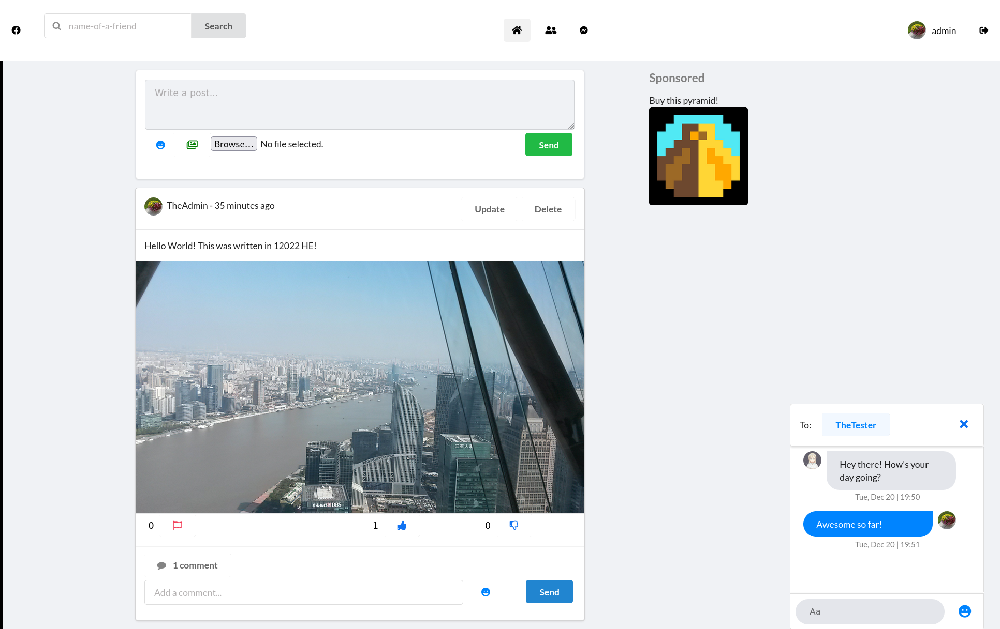
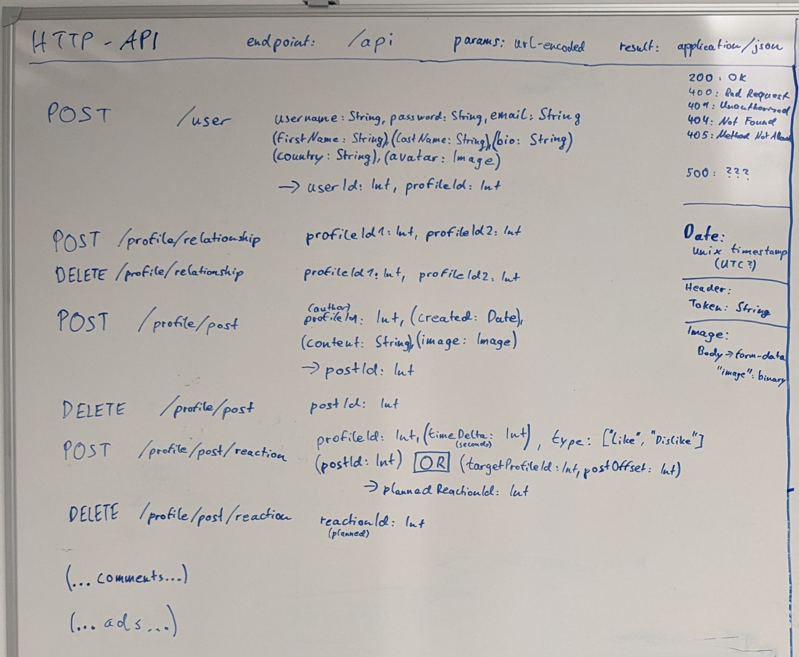

# Fakebook

This is the main repository of the Fakebook project, a tool capable of simulating a social media environment similar to Facebook for research purposes. This tool
can be used by researchers to study complex interactions and behavioral patterns in a controllable environment.


<!--  -->

## Using the tool
We offer access to Fakebook in two different ways:
1) Researchers can get free online access to the tool. We will create a new instance on a university server within the EU, and the researcher receives sole admin access for this instance. Thus, the researcher becomes the project maintainer of his or her instance and can inspect and control all data on this instance. If you would like to have online access, please send an email with your name, institution, start date and anticipated end date of the project to support@fakebook.projects.bayern

2) Researchers can download the open-source project from this Github repository and either install the system on their own server with a Docker container or with manual deployment. By this, the researcher becomes the project maintainer of his or her system and can inspect and control all data on this system. For this option, please read the following documentation carefully.

Important:
* When using out tool for research purposes, please cite our paper: Voggenreiter, A; Brandt S; Putterer, F; Frings, A and Pfeffer J. The Role of Likes: How Online Feedback Impacts Users' Mental Health (2023). 
https://arxiv.org/abs/2312.11914
* Fakebook allows to setup a Social-Media-Environment, in which users can interact freely. Every interaction can be watched and controlled by the project maintainer (e.g. the researcher). The project maintainer is responsible for everything happening on his or her social media environment. The tool should be used in an ethical responsible manner. Study participants and other users of the social media environment have to be informed that all of their data can be inspected by the project maintainer. The project maintainers are responsible for clarifying the standards of acceptable and hatefree behavior and are expected to take appropriate and fair corrective action in response to any instances of unacceptable behavior. Project maintainers have the right and responsibility to remove, edit, or reject posts and comments, or to ban temporarily or permanently any user for other behaviors that they deem inappropriate, threatening, offensive, illegal or harmful.
   
## Deployment
Fakebook is a web app and can be used with any modern Desktop or Mobile web browser.
All administration functionality is available via the user interface admin route (https://example.com/admin) or via an API (https://example.com/api).
It is installed on a server and functions as a standalone application, handling incoming HTTP requests itself. A separate web server is not required.

Fakebook can be set up behind a reverse proxy like nginx to allow for selective responses based on requested domain and route. This also allows using the application in conjunction with SSL/TLS over the HTTPS protocol, which is STRONGLY RECOMMENDED.

### Docker
The easiest way to deploy the software for testing or production purposes is by using docker. Beforehand, you will have to install Docker on your system.

Start by cloning the repository:

```
git clone [https://the-git.server/fakebook.git] fakebook
cd fakebook
```

The repository contains a Dockerfile. The image can be built based on this using docker:

```
docker build . -t fakebook
```

This should've built a runnable docker image, that can be used to create a container.

#### Running the container using docker-compose
The easiest way to scalably manage the containers is using docker compose.

Navigate to the directory you want your stack to be located in. Then create the docker-compose.yml file:

```
nano docker-compose.yml
```

and enter the following configuration:

```
version: "3.9"

services:

  demo:
    image: fakebook
    ports:
      - "8000:8000"
    volumes:
      - ./data/demo:/fakebook/data

  prod:
    image: fakebook
    ports:
      - "8001:8000"
    volumes:
      - ./data/prod:/fakebook/data
```

You can define more services, rename them, specify different ports for each service (first port is the external / host port) and change their data directory location.

You can then proceed to start services using:

```
docker compose up -d demo
```

This will create and start the demo instance and detach from it.

To see all running services, execute:

```
docker compose ps
```

Your instance should now be running on the desired address and port, e.g. `http://localhost:8000`.

To stop a service, run:

```
docker compose stop [service]
```

All instances will create a data directory in `./data/` on their first launch and copy their template database into there. The data files represent the entire instance and can be copied, replaced and backed up. They will survive destruction of the container itself.

#### Running the container manually

You can also run the container manually, although running using docker-compose is recommended.

```
docker run -d -p 8000:8000 -v [working-directory]/data/demo:/fakebook/data --name demo fakebook
```

REPLACE `[working-directory]` with the location you want the data of the container(s) to be stored in.

This will run the image in a new container named demo, on port 8000, map the `./data/demo` directory and detach the terminal.


To check if it's running, use:

```
docker ps
```

Your instance should now be running on the desired address and port, e.g. `http://localhost:8000`.

To stop the instance, use:
```
docker stop demo
```

The instance will copy it's data template into the data directory on its first launch. The data files represent the entire instance and can be copied, replaced and backed up. They will survive destruction of the container itself.

### Manual deployment

The dependencies can be installed and the software can be run directly. This is useful for development purposes.
This is achieved by creating a virtual environment, installing the required dependencies and running the web server as follows:

Install virtualenv and python 3. This depends on your operating system:

```shell
sudo apt install python3 python3-pip
sudo pip3 install virtualenv
```

Clone the repository:

```
git clone [https://the-git.server/fakebook.git] fakebook
cd fakebook
```

Create a virtual environment and activate it:

```shell
virtualenv .venv
source .venv/bin/activate
```

Install the required dependencies:

```shell
pip install -r requirements.txt
```

Collect the static files so they are shipped in a production environment:

```shell
python ./src/manage.py collectstatic
```

Run the server:
```shell
python ./src/manage.py runserver 0.0.0.0:8000
```
### First steps after deployment
Your instance should now be running on the desired address and port, e.g. `http://localhost:8000`. There you can login to the system and interact on the platform (publish posts,....). In the beginning, there are no user accounts in the system, except one admin account. The login details for the admin account are:
username: Admin
password: fb_apfel

Over the admin panel, e.g. accessible on `http://localhost:8000/admin`, new user accounts can be created. For more details on the platform and the admin panel, see the Fakebook Manual in the gitlab folder.

## Management API
The fakebook application contains an API that can be used to automate certain tasks. It can be used to automatically set up testing environments for development and studies on large scales without having to manually create lots of accounts and posts. This can be achieved by creating a program that automatically calls the API and therefore creates all of the content.

### Making a request
The API can be found at the `/api` route.

#### Authorization
All requests to this route have to contain a `Token` Header for authorization. The value of the token can be seen and set in the django administration panel in the configuration section.

#### Request format
The API doesn't support retrieving information, only creating new information. It therefore only uses the POST and DELETE methods. All parameters (apart from images) have to be sent as url-encoded.

Dates/Times are encoded as Unix epoch timestamps in seconds.

#### Binary content
In case an image is being submitted, insert it into the body of type `form-data` as the value of a key named `avatar`/`image`.

#### Response
The result is of `application/json` type. It usually indicates the ID of the created object.

The response code will be 200, 400, 401, 404 or 405.

### Route specification
There is an interactive up to date documentation avaiable at [/docs/api.html](/docs/api.html). It does not contain any response information, for this, see the image below.

You will need to serve the file using a webserver. You will also require an internet connection.
Alternatively, you can preview it using the [Swagger Editor](https://editor.swagger.io/) by just pasting the [OpenAPI specification](/docs/api-openapi.yaml). GitHub and GitLab may also be capable of [rendering it](/docs/api-openapi.yaml) for you.

### Route documentation
The following image shows all routes available in the API except for the `/api/advertisement` route, including their parameters and response:



Some of those parameter names may be outdated, for an up to date documentation of the actual parameter names and all routes, see the OpenAPI and postman collections.

### OpenAPI documentation
An up to date OpenApi documentation can be found [here](/docs/api-openapi.yaml).

The documentation can be interactively visualized using [Swagger](https://editor.swagger.io/).


### Postman collection
An up to date postman collection documenting the API can be found [here](/docs/api-postman.json).


### Python implementation template
A small library that can be used for accessing the API using Python can be found at [docs/api-access-template/api.py](docs/api-access-template/api.py).

Using it you can easily send requests to a Fakebook instance in the following way:

```python
from api import ApiAccessor
api = ApiAccessor(base_url="http://localhost:8000/api", token="yourtoken")

api.create_user(…)
api.create_relationship(…)
api.…
```

Change the base url to point at your Fakebook instance and obtain (or set) the management token from the admin panel's [configuration section](http://localhost:8000/admin/configuration/configuration/1/change/).

The implementation <span style="text-decoration: underline">**isn't complete**</span> though and you might have to add additional parameters and routes, in case you need them.
Notably, it is missing support for images on the (create) `/user` route and missing an implementation of the entire `/advertisement` route.

Please also take note that the template does not URL-encode the parameters. If you are using special characters, you need to encode them yourself or adapt the code.

## Development

### Structure
The application is structured into multiple django apps:

- Fakebook: the main app, linking all other apps together and containing utility
- Posts: handles posts, comments and reactions, responsible for rendering the main page
- Profiles: handles profiles and relationships, responsible for profile list, invite system and profile pages
- Advertisements: handles advertisements, displayed on the main page
- Analytics: monitors the users behavior, including session time and post view time
- Chat: handles the chat system, drawer and windows, is embedded as an iframe on every page
- Configuration: handles the configuration model


#### Interface generation / Networking
In most cases, all dynamic information gets rendered into django templates on the backend and then shipped as a static page. The only two exceptions are the chat and analytics systems.
The entire chat system is handled dynamically on the frontend using JavaScript and communicates with the backend using WebSockets.
The analytics module also uses WebSockets for communication.

#### Database template
If the application detects its `data` folder (including database file and image resources) to be missing during startup, it will look for the `data.template` folder and copy its contents. The template folder should therefore always be kept up to date during the development process and be updated to a (preferably clean) new version after each database migration.

### Debug mode / Static Files
The application will serve static files using the WhiteNoise middleware in production mode. For this to work, the static files have to be collected beforehand.

For development purposes, using `DEBUG_MODE` is recommended. This will automatically serve all static files without prior collection, allowing them to be modified and updated immediately during development. Additionally, a detailed error description page will be shown in case of an error.
`DEBUG_MODE` can be enabled by setting the environment variable `DEBUG_MODE=1`.

Alternatively, production mode can be used. This will require you to run
```
python3 src/manage.py collectstatic
```
beforehand and each time you update a file.

The docker build runs this command automatically.

**Always use production mode in production environments.**

### Model change / Database migration
When changing any part of the model you need to regenerate the migrations and apply them to migrate the database.

```
python3 src/manage.py makemigrations
```

This will update all migration scripts. You can then apply them using:

```
python3 src/manage.py migrate
```

This will migrate your database.

The docker build process will not run database migrations. The application will repopulate its data folder using the template on startup if it detects its data to be missing. You will therefore have to **copy your migrated database file over to the** `data.template` folder when you migrate the database during development.
This also means that you will have to run them manually in case you want to update the database of a deployed instance to a new schema.


#### Database migration for deployed instance
The docker container and application do not migrate an existing DB automatically when upgraded. You will therefore have to manually migrate the database when updating the version / schema on a deployed instance.

This can be achieved by downloading the database and running migrations locally.
Another option is to run the migrations using the deployed instance in the docker container. This can be achieved by e.g. manipulating the start command of the deployed docker container to run the migration command. The application itself mustn't be running during the migration.

Further details of implementing this are left to the reader.

### Internationalization (I18n) / Translation (T9n)
The project uses django's internationalization mechanism for translation.

HTML Template files and dynamically generated content in python code refer to keys for each string literal that has to be translated using the `translate` and `blocktranslate`tags and the `gettext` methods. The translation for each specific language and each key can be found in `./src/{appdir}/locale/{lang}/LC_MESSAGES/django.po`.

After new keys for translation have been created using the html template tags `translate` and `blocktranslate` or the python `ugettext_lazy` method in code, the translation files need to be regenerated. This can be achieved my navigating to the app's directory and running the following commands:

```
cd ./src/{appdir}/
django-admin makemessages -l en
django-admin makemessages -l de
```

`django-admin` is installed alongside django if you are using the pip dependency manager. You might have to enable your virtual environment.

You should now have all the new message keys in your translation files. You can now manually edit their translations in the `django.po` files. Once you are satisfied, just run

```
django-admin compilemessages
```

in the same directory to compile them to `django.mo` files which will then be used by the actual application.
You also have to do this if you modify them later on.


### Miscellaneous
Some other noteworthy information:

#### User-Profile Duality:
Just like with the particle-wave duality, you never know what you're dealing with. Is it called a login? That's a user. Is it called a user? Might as well be a profile. Is it called a profile? Also a profile. Author? Euhm, don't ask me.

Fakebook uses a framework for user authentication which brings its own `User` class. Additionally, on user creation, it creates and links its own `Profile` object to the new user. The <span style="text-decoration: underline">**user is used for authentication**</span> (loginname, password, email), the <span style="text-decoration: underline">**profile for everything else**</span> Fakebook related (firstname, lastname, bio, ...).

There are some duplicate fields on them, `firstname` and `lastname` on the `User` are ignored, and `email` on the `profile` is ignored.

The variable naming in code is quite inconsistent. In most cases relating to business logic profiles are used but are called users (which leads to the beautiful `user.user` statement). So make sure to check which one it is in either case.

#### Displaynames
If you set a firstname on a user's profile, it will be displayed instead of the username.

#### Setup Script
A sample setup script which was used for creating and populating user accounts for a social media study that uses the API to do so can be found in [setup-script/New_User_Setup.ipynb](setup-script/New_User_Setup.ipynb)

